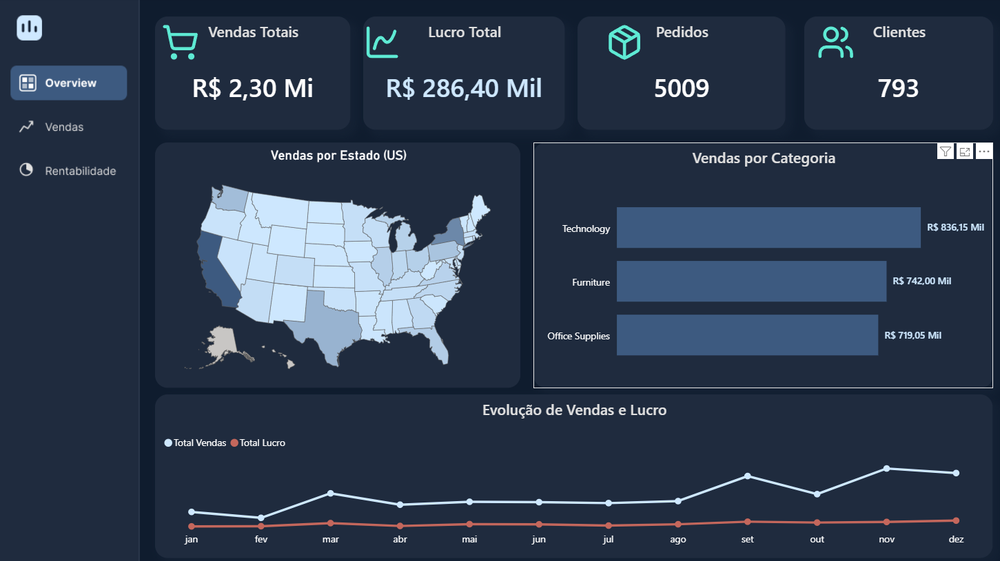
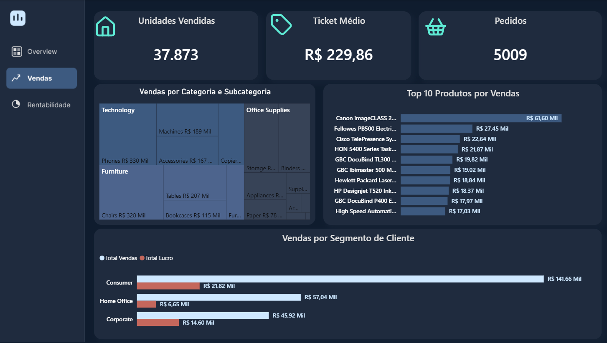
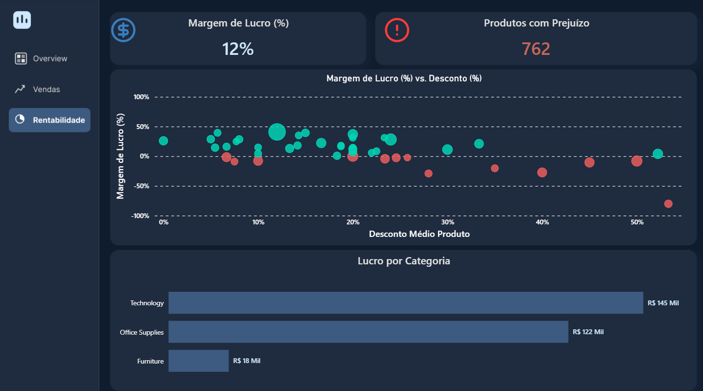

# Superstore Analytics — Power BI

Projeto de Data Analytics/BI desenvolvido para transformar o dataset
Superstore em uma visão executiva de vendas, desempenho comercial e
rentabilidade.

## Arquitetura

`Superstore CSV → Python (exploração) → PostgreSQL → SQL View → Power BI → DAX → Dashboard`

> A pasta auditada não contém o script de carga do CSV no PostgreSQL. O
> PostgreSQL é confirmado pela view criada sobre a tabela `superstore` e pela
> arquitetura do projeto, mas a implementação da carga deve ser documentada ou
> adicionada futuramente.

## Tecnologias

- Python e pandas
- PostgreSQL
- SQL
- Power BI
- DAX

## Pipeline

1. `data/superstore.csv`: dataset de origem, com 9.994 registros e 21 colunas.
2. Python: leitura em `cp1252` e exploração inicial de colunas, amostra,
   estatísticas descritivas e completude.
3. PostgreSQL: tabela bruta `superstore`.
4. SQL: a view `vw_superstore_dashboard` padroniza nomes, converte datas e
   adiciona atributos de calendário, prazo de envio e margem de lucro.
5. Power BI: modelo com `fato_vendas`, `Calendario`, `Medidas` e
   `Top Bottom Produtos`.
6. DAX: medidas alimentam indicadores e visuais das três páginas.

## Dashboard

### 1. Overview

Resumo executivo com vendas, lucro, pedidos, clientes, distribuição geográfica,
categorias e evolução temporal.

### 2. Performance Comercial

Visão de unidades vendidas, ticket médio, pedidos, categorias, subcategorias,
produtos e segmentos de clientes.

### 3. Rentabilidade

Análise de margem, produtos com prejuízo, relação entre desconto e margem e
lucro por categoria.

## Medidas confirmadas

Entre as medidas referenciadas pelos visuais estão: Total Vendas, Total Lucro,
Total Pedidos, Total Clientes, Total Quantidade, Ticket Médio, Margem %,
Produtos com Prejuízo, Margem Produto e Desconto Médio Produto.

As fórmulas DAX ainda não estão documentadas em texto no repositório.

## Estrutura para publicação

- `sql/`: exploração, criação da view e consultas analíticas.
- `python/`: leitura portável e exploração do CSV.
- `images/`: imagens técnicas e capturas finais do dashboard.
- `docs/`: documentação complementar do modelo.

## Insights e recomendações

> Espaço reservado para uma etapa posterior de análise e recomendações de
> negócio, com resultados validados diretamente na base.
